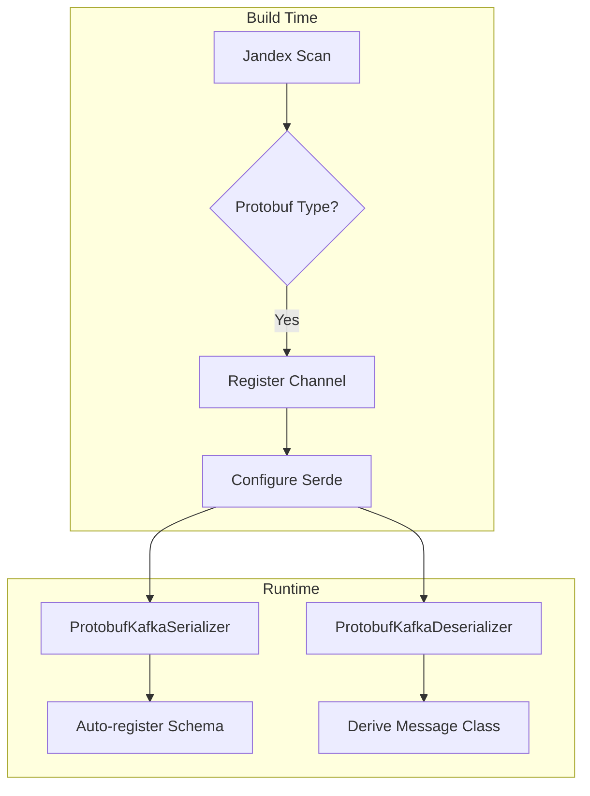

# Quarkus Apicurio Registry Protobuf Extension

A Quarkus extension for seamless Protobuf serialization with Kafka and [Apicurio Registry](https://www.apicur.io/registry/) v3.

This extension **auto-detects Protobuf message types** in your Kafka channels and automatically configures the correct serializers/deserializers - no manual configuration required.

## Features

- **Zero-config serialization** - Automatically configures `ProtobufKafkaSerializer` and `ProtobufKafkaDeserializer`
- **Schema registry integration** - Auto-registers schemas and derives message classes
- **DevServices** - Apicurio Registry starts automatically in dev/test mode
- **Type-safe messaging** - Full Protobuf type support with generated Java classes
- **Native image support** - Works with GraalVM native compilation

## Architecture

```mermaid
flowchart LR
    subgraph Producer Service
        P[Java App] --> E[Emitter&lt;Proto&gt;]
        E --> S[ProtobufSerializer]
    end

    S --> K[(Kafka Topic)]
    S -.->|register schema| R[(Apicurio Registry)]

    subgraph Consumer Service
        D[ProtobufDeserializer] --> C[@Incoming]
        C --> A[Java App]
    end

    K --> D
    R -.->|fetch schema| D
```

## Quick Start

### 1. Add the dependency

```gradle
implementation 'io.quarkus:quarkus-apicurio-registry-protobuf:0.0.1-SNAPSHOT'
```

### 2. Define your Protobuf message

Create `src/main/proto/order.proto`:

```protobuf
syntax = "proto3";
package com.example.orders;

option java_package = "com.example.orders.proto";
option java_outer_classname = "OrderProtos";

message OrderEvent {
  string order_id = 1;
  string customer_id = 2;
  double amount = 3;
  int64 timestamp = 4;
  map<string, string> metadata = 5;
}
```

### 3. Create a producer

```java
@ApplicationScoped
public class OrderProducer {

    @Inject
    @Channel("orders-out")
    Emitter<OrderEvent> emitter;

    public void sendOrder(String customerId, double amount) {
        OrderEvent order = OrderEvent.newBuilder()
                .setOrderId(UUID.randomUUID().toString())
                .setCustomerId(customerId)
                .setAmount(amount)
                .setTimestamp(System.currentTimeMillis())
                .putMetadata("source", "order-service")
                .build();

        emitter.send(order);
    }
}
```

### 4. Create a consumer

```java
@ApplicationScoped
public class OrderConsumer {

    private static final Logger LOG = LoggerFactory.getLogger(OrderConsumer.class);

    @Incoming("orders-in")
    public void processOrder(OrderEvent order) {
        LOG.info("Received order: {} for customer {} - ${}",
                order.getOrderId(),
                order.getCustomerId(),
                order.getAmount());
    }
}
```

### 5. Configure application.properties

```properties
# Kafka connector (required for DevServices to detect channels)
mp.messaging.outgoing.orders-out.connector=smallrye-kafka
mp.messaging.incoming.orders-in.connector=smallrye-kafka

# Topic configuration
mp.messaging.outgoing.orders-out.topic=orders
mp.messaging.incoming.orders-in.topic=orders
```

### 6. Run it!

```bash
./gradlew quarkusDev
```

DevServices automatically starts Kafka and Apicurio Registry. That's it!

## How It Works



At **build time**, the extension:
1. Scans your code for `@Incoming`, `@Outgoing`, and `@Channel` annotations
2. Detects if the message type extends `com.google.protobuf.MessageLite`
3. Automatically configures the Protobuf serializer/deserializer for those channels

At **runtime**, the extension:
1. Uses `ProtobufKafkaSerializer` to serialize outgoing messages
2. Auto-registers the Protobuf schema with Apicurio Registry
3. Uses `ProtobufKafkaDeserializer` to deserialize incoming messages
4. Derives the correct Java class from the schema registry

## Configuration Reference

### Auto-configured Properties

The extension automatically sets these properties for detected Protobuf channels:

| Property | Outgoing | Incoming | Description |
|----------|:--------:|:--------:|-------------|
| `value.serializer` | ✓ | | `ProtobufKafkaSerializer` |
| `value.deserializer` | | ✓ | `ProtobufKafkaDeserializer` |
| `auto.offset.reset` | | ✓ | `earliest` |
| `apicurio.protobuf.derive.class` | | ✓ | `true` - derive Java class from registry |
| `apicurio.registry.auto-register` | ✓ | ✓ | `true` - auto-register schemas |
| `apicurio.registry.artifact-resolver-strategy` | ✓ | ✓ | `SimpleTopicIdStrategy` |
| `apicurio.registry.find-latest` | ✓ | ✓ | `true` - use latest schema version |

### Overriding Defaults

All properties can be overridden in `application.properties`:

```properties
# Use a different serializer for a specific channel
mp.messaging.outgoing.orders-out.value.serializer=my.custom.Serializer

# Disable auto-registration for a channel
mp.messaging.outgoing.orders-out.apicurio.registry.auto-register=false

# Use a different artifact strategy
mp.messaging.connector.smallrye-kafka.apicurio.registry.artifact-resolver-strategy=io.apicurio.registry.serde.strategy.TopicIdStrategy
```

### DevServices Configuration

| Property | Default | Description |
|----------|---------|-------------|
| `quarkus.apicurio-registry.protobuf.devservices.enabled` | `true` | Enable/disable DevServices |
| `quarkus.apicurio-registry.protobuf.devservices.image-name` | `apicurio/apicurio-registry:3.0.0` | Container image |
| `quarkus.apicurio-registry.protobuf.devservices.port` | Random | Fixed port (optional) |

## Running in Production

When running outside dev/test mode, you need to provide Kafka and Apicurio Registry:

### Using Docker Compose

```yaml
services:
  kafka:
    image: quay.io/strimzi/kafka:latest-kafka-3.6.0
    command:
      - "sh"
      - "-c"
      - "./bin/kafka-storage.sh format --standalone -t $$(./bin/kafka-storage.sh random-uuid) -c ./config/server.properties && ./bin/kafka-server-start.sh ./config/server.properties"
    ports:
      - "9092:9092"
    environment:
      LOG_DIR: "/tmp/logs"

  apicurio-registry:
    image: apicurio/apicurio-registry:3.0.0
    ports:
      - "8081:8080"
    environment:
      QUARKUS_PROFILE: prod
```

### Production Configuration

```properties
# application.properties
%prod.kafka.bootstrap.servers=kafka:9092
%prod.mp.messaging.connector.smallrye-kafka.apicurio.registry.url=http://apicurio-registry:8080/apis/registry/v3
```

Or via environment variables:

```bash
export KAFKA_BOOTSTRAP_SERVERS=kafka:9092
export MP_MESSAGING_CONNECTOR_SMALLRYE_KAFKA_APICURIO_REGISTRY_URL=http://apicurio-registry:8080/apis/registry/v3
```

## Multiple Topics Example

```properties
# Order events
mp.messaging.outgoing.orders-out.connector=smallrye-kafka
mp.messaging.outgoing.orders-out.topic=orders
mp.messaging.incoming.orders-in.connector=smallrye-kafka
mp.messaging.incoming.orders-in.topic=orders

# Inventory events
mp.messaging.outgoing.inventory-out.connector=smallrye-kafka
mp.messaging.outgoing.inventory-out.topic=inventory
mp.messaging.incoming.inventory-in.connector=smallrye-kafka
mp.messaging.incoming.inventory-in.topic=inventory

# Payment events
mp.messaging.outgoing.payments-out.connector=smallrye-kafka
mp.messaging.outgoing.payments-out.topic=payments
```

## Troubleshooting

### Schema not found

If you see `Schema not found` errors, ensure:
1. `apicurio.registry.auto-register=true` is set (default)
2. The producer has sent at least one message to register the schema
3. The registry URL is correct

### Wrong message type

If deserialization returns the wrong type:
1. Verify `apicurio.protobuf.derive.class=true` is set (default)
2. Check that your Protobuf class is on the classpath
3. Ensure the schema in the registry matches your Java class

### DevServices not starting

If Kafka or Registry containers don't start:
1. Verify Docker is running
2. Check `quarkus.apicurio-registry.protobuf.devservices.enabled=true`
3. Ensure `connector=smallrye-kafka` is set for your channels

## Requirements

- Quarkus 3.x
- Java 17+
- Docker (for DevServices in dev/test mode)

## License

MIT License
