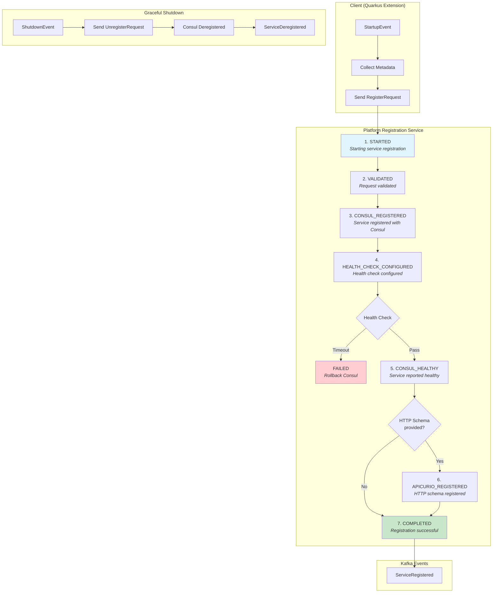
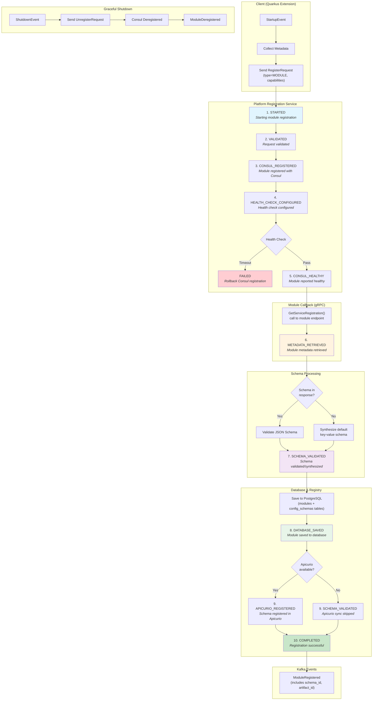
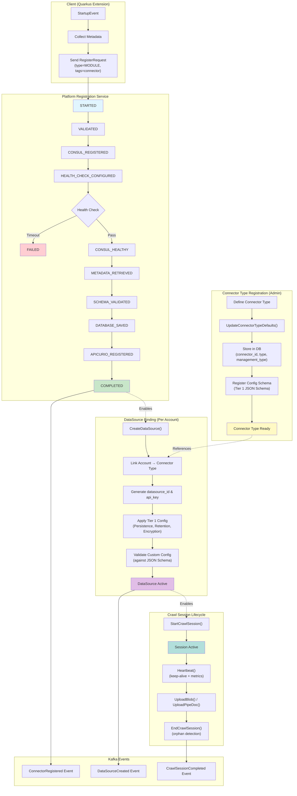

# Pipestream Service Registration Extension

A Quarkus extension for the Pipestream AI platform that provides automatic service and module registration with the `platform-registration-service`. This extension enables zero-configuration service discovery by automatically registering your Quarkus services with the platform's centralized registry.

## Overview

The Pipestream Service Registration Extension simplifies service registration in the Pipestream AI platform by:

- **Automatically discovering** service metadata from Quarkus configuration
- **Registering services** with the platform-registration-service on startup
- **Handling graceful shutdown** with automatic deregistration
- **Providing retry logic** with exponential backoff for registration failures
- **Supporting both services and modules** through a unified API

The extension communicates with the `platform-registration-service` via gRPC, which then handles Consul registration, health check configuration, and event broadcasting to Kafka.

> Note: The `pipestream-server` extension is being designed to own registration defaults
> (host selection, HTTP/gRPC health defaults, and base paths). When present, it will
> provide common defaults so each service only needs to set its port and optional overrides.
> See `pipestream-server/README.md` for the design details.

## Features

| Feature | Description |
|---------|-------------|
| Zero-configuration auto-registration | Just add the extension, services register automatically |
| Auto-discovers service metadata | Name, version, host, port from Quarkus config |
| Supports services and modules | Unified registration API for both service types |
| Streaming registration updates | Real-time progress tracking via gRPC streams |
| Graceful deregistration | Clean shutdown handling with automatic unregistration |
| Retry with exponential backoff | Handles registration failures automatically |
| gRPC-based communication | Uses platform-registration-service gRPC API |
| Reactive programming | Built on Mutiny for non-blocking operations |
| Internal/external address support | Handles Docker/K8s port mapping scenarios |
| TLS support | Configurable TLS for secure gRPC connections |

## Registering Services, Modules, and Connectors

This extension supports three types of registrations, each serving different purposes in the Pipestream platform:

| Type | Purpose | Use Case |
|------|---------|----------|
| **Service** | Standalone backend services | API gateways, core platform services, data processors |
| **Module** | Service extensions with capabilities | PDF parsers, OCR engines, text extractors |
| **Connector** | Data source/sink integrations | S3 connectors, database connectors, messaging integrations |

### How Registration Works

1. **On Startup**: The extension observes Quarkus `StartupEvent` and initiates registration
2. **Metadata Collection**: Service information is auto-discovered from Quarkus configuration
3. **gRPC Registration**: A `RegisterRequest` is sent to `platform-registration-service` via gRPC streaming
4. **Status Updates**: The service receives real-time `RegisterResponse` events (PENDING → IN_PROGRESS → COMPLETED)
5. **Service ID Assignment**: On successful registration, a unique service ID is returned
6. **On Shutdown**: The extension observes `ShutdownEvent` and sends `UnregisterRequest` for graceful deregistration

### Registering a Service

Services are the default registration type. They represent standalone backend components.

**Step 1: Add the dependency** (see [Quick Start](#quick-start))

**Step 2: Configure your service identity**

```properties
# application.properties
quarkus.application.name=my-backend-service
quarkus.application.version=1.0.0

# Registration is enabled by default
pipestream.registration.enabled=true

# Type defaults to SERVICE
pipestream.registration.type=SERVICE
```

**Step 3: Configure the registration service connection**

There are two ways to connect to the platform-registration-service:

**Option A: Consul Service Discovery (Recommended)**

If you have Consul running, the extension will automatically discover the registration service. With default settings (no explicit host/port configured), it will:
1. Connect to Consul at `localhost:8500`
2. Look up the service named `platform-registration`
3. Use the discovered host/port for gRPC connection

```properties
# Zero-config: Uses Consul at localhost:8500 to discover "platform-registration"
# (No configuration needed - this is the default behavior)

# Or explicitly configure Consul and/or service name:
pipestream.registration.consul.host=consul.example.com
pipestream.registration.consul.port=8500
pipestream.registration.registration-service.discovery-name=platform-registration
```

**Option B: Direct Connection**

If you're not using Consul, specify the registration service host/port directly:

```properties
# Direct connection (skips Consul discovery)
pipestream.registration.registration-service.host=platform-registration-service.internal
pipestream.registration.registration-service.port=9090
```

> **Note:** If `host` and `port` are not configured, the extension assumes Consul is available and attempts service discovery. To use direct connection, set both `host` and `port` explicitly (any `discovery-name` will be ignored).

**Step 4: Configure network settings**

```properties
# Advertised address (what clients use to connect)
pipestream.registration.advertised-host=my-service.example.com
pipestream.registration.advertised-port=9000

# Optional: Tags for discovery and filtering
pipestream.registration.tags=production,backend,api
```

**Step 4: Start your application** - Registration happens automatically.

### Registering a Module

Modules are service extensions that advertise specific **capabilities**. Other services can discover modules by their capabilities.

**Configuration:**

```properties
# application.properties
quarkus.application.name=pdf-processor-module
quarkus.application.version=2.1.0

# Set type to MODULE
pipestream.registration.type=MODULE

# Declare capabilities this module provides
pipestream.registration.capabilities=parse-pdf,extract-text,extract-images,ocr

# Optional: Add descriptive tags
pipestream.registration.tags=document-processing,ai-powered

# Registration service endpoint
pipestream.registration.registration-service.host=platform-registration-service
pipestream.registration.registration-service.port=9090

# Network configuration
pipestream.registration.advertised-host=pdf-module.internal
pipestream.registration.advertised-port=9000
```

**Capabilities** allow other services to discover what this module can do. For example, a document processing pipeline might query for modules with the `parse-pdf` capability.

### Registering a Connector

Connectors are specialized modules that integrate with external data sources or sinks. Register them as modules with connector-specific capabilities and tags.

**Configuration:**

```properties
# application.properties
quarkus.application.name=s3-data-connector
quarkus.application.version=1.5.0

# Connectors are registered as modules
pipestream.registration.type=MODULE

# Connector-specific capabilities
pipestream.registration.capabilities=read-object,write-object,list-objects,delete-object,presign-url

# Tag as a connector for discovery
pipestream.registration.tags=connector,data-connector,storage,aws,s3

# Description helps with discovery
pipestream.registration.description=AWS S3 storage connector for object read/write operations

# Registration service endpoint
pipestream.registration.registration-service.host=platform-registration-service
pipestream.registration.registration-service.port=9090

# Network configuration
pipestream.registration.advertised-host=s3-connector.internal
pipestream.registration.advertised-port=9000
```

**Example connectors and their capabilities:**

| Connector | Capabilities | Tags |
|-----------|-------------|------|
| S3 Connector | `read-object`, `write-object`, `list-objects` | `connector`, `storage`, `aws` |
| PostgreSQL Connector | `query`, `insert`, `update`, `delete`, `transaction` | `connector`, `database`, `sql` |
| Kafka Connector | `produce`, `consume`, `admin` | `connector`, `messaging`, `streaming` |
| SFTP Connector | `upload`, `download`, `list`, `delete` | `connector`, `file-transfer` |

### Registering HTTP Endpoints

Services can also register their HTTP/REST endpoints for discovery. This is useful for services that expose both gRPC and HTTP APIs.

```properties
# Enable HTTP endpoint registration
pipestream.registration.http.enabled=true

# HTTP endpoint configuration
pipestream.registration.http.scheme=https
pipestream.registration.http.advertised-host=api.example.com
pipestream.registration.http.advertised-port=8443
pipestream.registration.http.base-path=/api/v1
pipestream.registration.http.health-path=/q/health
pipestream.registration.http.tls-enabled=true

# Optional: Register OpenAPI schema
pipestream.registration.http.schema=/openapi.json
pipestream.registration.http.schema-version=1.0.0
```

**SSL/TLS Support for HTTP Health Checks:**

When `pipestream.registration.http.tls-enabled` is set to `true`:
- The health check scheme defaults to `https://` (if `pipestream.registration.http.scheme` is not explicitly set).
- The Consul health check is configured with `tlsSkipVerify(true)`, allowing health checks to pass when using internal or self-signed certificates.
- The registration metadata will include `tls_enabled=true`.

### Programmatic Access

You can inject `ServiceRegistrationManager` to check registration status or get the assigned service ID:

```java
@ApplicationScoped
public class MyService {
    @Inject
    ServiceRegistrationManager registrationManager;

    public void onReady() {
        // Check current registration state
        RegistrationState state = registrationManager.getState();

        if (state == RegistrationState.REGISTERED) {
            // Get the assigned service ID
            String serviceId = registrationManager.getServiceId();
            log.info("Service registered with ID: {}", serviceId);
        } else if (state == RegistrationState.FAILED) {
            log.error("Service registration failed");
        }
    }
}
```

### Service Registration Lifecycle

Services follow a 7-phase registration flow focused on service discovery and health checks:



### Module Registration Lifecycle

Modules have an extended 10-phase lifecycle that includes metadata retrieval via gRPC callback, schema management, and database persistence:



**Module Callback Details:**

During registration (step 6), the platform calls back to your module's `GetServiceRegistration()` gRPC endpoint to retrieve:
- `module_name`, `version`, `json_config_schema`
- `display_name`, `description`, `owner`, `documentation_url`
- `tags`, `dependencies`, custom `metadata`

If your module doesn't provide a schema, a default key-value OpenAPI 3.1 schema is synthesized automatically.

### Connector Registration Lifecycle

Connectors have a two-layer registration model: **Connector Type** (template) and **DataSource** (instance). This supports multi-tenant configurations with 2-tier settings:



**Connector Configuration Tiers:**

| Tier | Scope | Examples |
|------|-------|----------|
| **Tier 1** (Global) | Connector-wide settings | `PersistenceConfig`, `RetentionConfig`, `EncryptionConfig`, custom JSON Schema config |
| **Tier 2** (Node) | Per-pipeline overrides | Routing hints, node-specific settings, pipeline graph configuration |

**Management Types:**

| Type | Description |
|------|-------------|
| `MANAGED` | Platform-hosted connector, full lifecycle management |
| `UNMANAGED` | External connector, self-managed with API key authentication |

## Quick Start

### 1. Add the dependency

Add the extension to your Quarkus project's `build.gradle`:

```gradle
dependencies {
    implementation 'ai.pipestream:pipestream-service-registration:${pipestreamBomVersion}'
}
```

Or for Maven:

```xml
<dependency>
    <groupId>ai.pipestream</groupId>
    <artifactId>pipestream-service-registration</artifactId>
    <version>${pipestreamBomVersion}</version>
</dependency>
```

### 2. Configure the registration service connection (optional)

By default, the extension discovers the registration service via Consul at `localhost:8500`. If Consul is running with `platform-registration` registered, no configuration is needed.

For non-Consul environments, specify the endpoint directly in `application.properties`:

```properties
# Direct connection (only needed if not using Consul)
pipestream.registration.registration-service.host=registration-service.internal
pipestream.registration.registration-service.port=9090
```

### 3. That's it!

The extension automatically:
- Registers your service on startup
- Streams registration status updates
- Deregisters on shutdown

## Configuration

All settings have sensible defaults. Override as needed in your `application.properties`:

### Basic Configuration

```properties
# Enable/disable registration (default: true)
pipestream.registration.enabled=true

# Require successful registration before readiness (default: false)
pipestream.registration.required=false
# Timeout for required registration before shutdown (default: 10m)
pipestream.registration.required-timeout=10m
# When required, readiness stays DOWN until registration succeeds.

# Service identity (auto-detected from quarkus.application.name/version)
pipestream.registration.service-name=my-service
pipestream.registration.version=1.0.0

# Service type: SERVICE or MODULE (default: SERVICE)
pipestream.registration.type=SERVICE
```

### Network Configuration

```properties
# Advertised address (client-facing address)
pipestream.registration.advertised-host=0.0.0.0
pipestream.registration.advertised-port=9000

# Internal address (actual bind address, optional)
# Used for Docker/K8s scenarios where service binds to different address
pipestream.registration.internal-host=0.0.0.0
pipestream.registration.internal-port=9000

# TLS configuration
pipestream.registration.tls-enabled=false
```

### Registration Service Connection

The extension supports two methods for locating the platform-registration-service:

**Method 1: Consul Service Discovery (Default)**

When `host` and `port` are not configured, the extension automatically attempts Consul service discovery (using `discovery-name` when set):

```properties
# Consul client configuration (defaults shown)
pipestream.registration.consul.host=localhost
pipestream.registration.consul.port=8500

# Service name to look up in Consul (default: platform-registration)
pipestream.registration.registration-service.discovery-name=platform-registration
```

**Method 2: Direct Connection**

To bypass Consul and connect directly, set both `host` and `port` explicitly:

```properties
# Direct connection to registration service
pipestream.registration.registration-service.host=registration-service.internal
pipestream.registration.registration-service.port=9090

# Connection settings
pipestream.registration.registration-service.timeout=10s
pipestream.registration.registration-service.tls-enabled=false
```

**Discovery Logic:**

```mermaid
flowchart TD
    A[Start] --> B{host AND port set?}
    B -->|Yes| C[Use direct connection]
    B -->|No| D["Try Consul with<br/>discovery-name or default"]
    D --> E{Consul success?}
    E -->|Yes| F[Use discovered host:port]
    E -->|No| G["No discovery result<br/>and no host/port"]

    C --> H[gRPC Channel Created]
    F --> H
    G --> I[Registration retries (or fails if required timeout expires)]

    style H fill:#c8e6c9
    style I fill:#fff3e0
    style J fill:#e1f5fe
    style K fill:#c8e6c9
```

### Retry Configuration

```properties
# Retry behavior for registration failures
pipestream.registration.retry.max-attempts=5
pipestream.registration.retry.initial-delay=1s
pipestream.registration.retry.max-delay=30s
pipestream.registration.retry.multiplier=2.0
```

### Advanced Configuration

```properties
# Tags for service discovery and filtering
pipestream.registration.tags=production,backend,grpc

# Capabilities advertised by this service (primarily for modules)
pipestream.registration.capabilities=parse-pdf,extract-text
```

### Auto-Discovery

The extension automatically discovers the following from Quarkus configuration:

- **Service name**: From `quarkus.application.name` (defaults to "unknown-service")
- **Version**: From `quarkus.application.version` (defaults to "1.0.0")
- **gRPC port**: From `quarkus.grpc.server.port` (defaults to 9000)
- **HTTP port**: From `quarkus.http.port` (defaults to 8080)

These values are included in the service metadata automatically.

## Architecture

### Components

The extension consists of the following key components:

1. **ServiceRegistrationManager** (`@ApplicationScoped`)
   - Lifecycle management with startup/shutdown hooks
   - Handles registration retry logic
   - Manages registration state transitions
   - Observes Quarkus `StartupEvent` and `ShutdownEvent`

2. **ServiceMetadataCollector** (`@ApplicationScoped`)
   - Auto-discovers service information from Quarkus config
   - Collects metadata (Java version, Quarkus version, ports)
   - Resolves service name, version, and network configuration

3. **RegistrationClient** (`@ApplicationScoped`)
   - gRPC client wrapper for platform-registration-service
   - Manages gRPC channel lifecycle
   - Provides reactive `Multi` and `Uni` APIs using Mutiny
   - Handles streaming registration responses

4. **RegistrationProcessor** (Build-time)
   - Quarkus deployment processor
   - Registers extension beans at build time
   - Declares the extension feature

### Registration Flow

1. **Startup**: `ServiceRegistrationManager` observes `StartupEvent`
2. **Metadata Collection**: `ServiceMetadataCollector` gathers service information
3. **Registration**: `RegistrationClient` sends gRPC `RegisterRequest` to platform-registration-service
4. **Streaming Updates**: Receives `RegisterResponse` stream with progress events
5. **State Management**: Updates registration state (REGISTERING → REGISTERED)
6. **Shutdown**: Observes `ShutdownEvent` and sends `UnregisterRequest`

### Registration States

The extension tracks registration state through the `RegistrationState` enum:

- `UNREGISTERED` - Initial state, not yet registered
- `REGISTERING` - Registration in progress
- `REGISTERED` - Successfully registered
- `FAILED` - Registration failed after retries
- `DEREGISTERING` - Deregistration in progress
- `DEREGISTERED` - Successfully deregistered

### Proto Definition

The extension uses the following gRPC service from `buf.build/pipestreamai/registration`:

```protobuf
service PlatformRegistrationService {
  // Register a service or module with streaming status updates
  rpc Register(RegisterRequest) returns (stream RegisterResponse);
  
  // Unregister a service or module
  rpc Unregister(UnregisterRequest) returns (UnregisterResponse);
}

message RegisterRequest {
  string name = 1;
  ServiceType type = 2;  // SERVICE_TYPE_SERVICE or SERVICE_TYPE_MODULE
  Connectivity connectivity = 3;
  string version = 4;
  map<string, string> metadata = 5;
  repeated string tags = 6;
  repeated string capabilities = 7;
}
```

## Project Structure

This is a multi-module Quarkus extension project:

```
pipestream-service-registration/
├── runtime/              # Runtime implementation
│   └── src/main/java/
│       └── ai/pipestream/registration/
│           ├── ServiceRegistrationManager.java
│           ├── RegistrationClient.java
│           ├── ServiceMetadataCollector.java
│           ├── config/
│           │   └── RegistrationConfig.java
│           └── model/
│               ├── ServiceInfo.java
│               └── RegistrationState.java
├── deployment/           # Build-time deployment processor
│   └── src/main/java/
│       └── ai/pipestream/registration/deployment/
│           └── RegistrationProcessor.java
├── integration-tests/    # Integration tests
│   └── src/test/java/
│       └── ai/pipestream/registration/it/
│           └── RegistrationExtensionTest.java
└── build.gradle          # Root build configuration
```

## Building

### Prerequisites

- Java 21+
- Gradle 8.0+
- Access to `buf.build/pipestreamai/registration` proto definitions

### Build Commands

```bash
# Build the extension
./gradlew build

# Run tests
./gradlew test

# Build without tests
./gradlew build -x test

# Publish to local Maven repository
./gradlew publishToMavenLocal
```

### Proto Generation

The extension uses [Buf](https://buf.build) to fetch proto definitions and generates Java code using:

- `protoc` with gRPC Java plugin
- Quarkus gRPC Mutiny plugin for reactive stubs
- Custom `protoc-gen-mutiny` script for Mutiny code generation

Proto definitions are fetched from `buf.build/pipestreamai/registration` during the build process.

## Usage Examples

### Basic Service Registration

```java
@ApplicationScoped
public class MyService {
    @Inject
    ServiceRegistrationManager registrationManager;
    
    public void checkStatus() {
        RegistrationState state = registrationManager.getState();
        String serviceId = registrationManager.getServiceId();
        
        if (state == RegistrationState.REGISTERED) {
            System.out.println("Service registered with ID: " + serviceId);
        }
    }
}
```

### Module Registration

For registering a module instead of a service:

```properties
pipestream.registration.type=MODULE
pipestream.registration.capabilities=parse-pdf,extract-text,ocr
```

### Docker/Kubernetes Configuration

For services running in containers with port mapping:

```properties
# Advertised address (what clients use)
pipestream.registration.advertised-host=my-service.example.com
pipestream.registration.advertised-port=9000

# Internal address (actual bind address in container)
pipestream.registration.internal-host=0.0.0.0
pipestream.registration.internal-port=9000
```

## Development

### Adding the Extension to a Quarkus Project

1. Add the dependency to your project
2. Ensure the `platform-registration-service` is running and accessible
3. Configure the registration service endpoint
4. Start your service - registration happens automatically

### Debugging

Enable debug logging to see registration details:

```properties
quarkus.log.category."ai.pipestream.registration".level=DEBUG
```

### Testing

The extension includes unit tests in the `integration-tests` module. Run tests with:

```bash
./gradlew test
```

## Dependencies

### Runtime Dependencies

- Quarkus 3.30.2+
- Quarkus gRPC extension
- Quarkus SmallRye Health extension
- Mutiny (reactive programming)
- gRPC Java 1.77.0+
- Protobuf Java 4.33.1+

### Build Dependencies

- Buf CLI 1.61.0+ (for proto generation)
- Quarkus Extension Processor

## Publishing

The extension is published to:

- **Maven Central Snapshots**: `https://central.sonatype.com/repository/maven-snapshots/`
- **GitHub Packages**: `https://maven.pkg.github.com/ai-pipestream/pipestream-platform`

Versioning is managed by the `axion-release` Gradle plugin based on git tags.

## Troubleshooting

### Registration Fails on Startup

1. **Check registration service connectivity**:
   ```bash
   # Verify the service is running
   curl http://localhost:9090/health
   ```

2. **Verify configuration**:
   ```properties
   pipestream.registration.registration-service.host=localhost
   pipestream.registration.registration-service.port=9090
   ```

3. **Check logs** for detailed error messages:
   ```bash
   # Enable debug logging
   quarkus.log.category."ai.pipestream.registration".level=DEBUG
   ```

### Service Not Appearing in Consul

The extension registers with `platform-registration-service`, which then registers with Consul. If your service isn't appearing:

1. Verify the platform-registration-service is running
2. Check platform-registration-service logs for Consul connection issues
3. Verify your service metadata is valid

### Port Configuration Issues

If you're having port-related issues:

1. Ensure `quarkus.grpc.server.port` matches your advertised port
2. For Docker/K8s, configure both advertised and internal addresses
3. Check that the port is not already in use

## License

This project is licensed under the MIT License - see the [LICENSE](LICENSE) file for details.

## Contributing

Contributions are welcome! Please ensure that:

1. All tests pass: `./gradlew test`
2. Code follows existing style conventions
3. Proto definitions are fetched from `buf.build/pipestreamai/registration`

## Related Projects

- [platform-registration-service](../platform/core-services/platform-registration-service) - The central registration service
- [pipestream-protos](../platform/pipestream-protos) - Protocol buffer definitions
- [quarkus-dynamic-grpc](../quarkus-dynamic-grpc) - Dynamic gRPC service registration

## Support

For issues, questions, or contributions, please open an issue in the repository.
