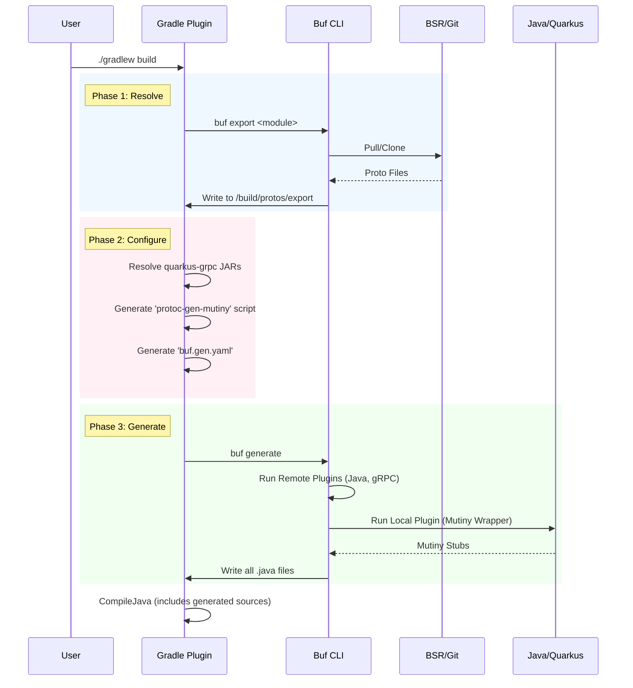

# **Design Document: Pipestream Proto Toolchain Plugin**

## **1. Executive Summary**

The **Pipestream Proto Toolchain** (ai.pipestream.proto-toolchain) is a bespoke Gradle plugin designed to modernize and unify the Protocol Buffer workflow across the Pipestream ecosystem.

It solves three critical problems:

1. **Dual-Source Resolution:** seamlessly switches between **Buf Schema Registry (BSR)** for internal development and **Git Repositories** for restricted client environments, without changing project code.
2. **"Split-Brain" Generation:** decoupling the generation of standard gRPC stubs (via Buf) from reactive Mutiny stubs (via Quarkus), allowing for "Protobuf Heaven"—modern, linted, annotation-rich protos with full reactive capabilities.
3. **Hermetic Builds:** Removing the need for developers or CI to manually install buf, protoc, or shell dependencies.

## **2. Architectural Overview**

The plugin operates as a pipeline with three distinct phases: **Resolve**, **Configure**, and **Generate**.

flowchart TD  
subgraph "Phase 1: Resolution (The Source of Truth)"  
direction TB  
Config[Plugin DSL] -->|Source Mode| Switch{Mode?}  
Switch -- "BSR (Default)" --> BufCLI1[Buf CLI]  
Switch -- "Git (Restricted)" --> BufCLI1

        BSR[(buf.build)] -.->|Pull Module| BufCLI1  
        Git[(Git Repo)] -.->|Clone/Checkout| BufCLI1  
          
        BufCLI1 -->|buf export| LocalCache[build/protos/export]  
    end

    subgraph "Phase 2: Configuration (The Bridge)"  
        Gradle[Gradle Plugin] -->|Resolve Classpath| MutinyJar[quarkus-grpc-protoc-plugin.jar]  
        Gradle -->|Generate| Wrapper[protoc-gen-mutiny Script]  
        Gradle -->|Generate| BufGen[buf.gen.yaml]  
          
        MutinyJar -.-> Wrapper  
        LocalCache --> BufGen  
    end

    subgraph "Phase 3: Generation (The Engine)"  
        BufGen --> BufCLI2[Buf CLI]  
        BufCLI2 -->|Remote Plugin| JavaOut[Standard Java POJOs]  
        BufCLI2 -->|Remote Plugin| GrpcOut[Standard gRPC Stubs]  
        BufCLI2 -->|Local Plugin (Wrapper)| MutinyOut[Quarkus Mutiny Stubs]  
    end

    LocalCache --> BufCLI2

## **3. Plugin DSL Specification**

The plugin exposes a clean, declarative DSL. Consumers define *what* they need, not *how* to get it.
```groovy
plugins {  
id 'ai.pipestream.proto-toolchain' version '1.0.0'  
}

pipestreamProtos {  
// Global toggle. Can be overridden via CLI: -PprotoSource=git  
// Values: 'bsr', 'git'  
sourceMode = providers.gradleProperty('protoSource').orElse('bsr')

    // Target directory for generated code (auto-added to sourceSets)  
    outputDir = layout.buildDirectory.dir("generated/source/proto")

    // The Quarkus gRPC version to use for Mutiny generation  
    quarkusGrpcVersion = "3.8.2" 

    modules {  
        register("intake") {  
            // Primary BSR source  
            bsr = "buf.build/pipestreamai/intake"  
              
            // Git fallback configuration  
            gitRepo = "[https://github.com/ai-pipestream/intake.git](https://github.com/ai-pipestream/intake.git)"  
            gitRef = "v1.2.0"   // Tag, branch, or commit  
            gitSubdir = "proto" // Support for monorepos (sparse checkout)  
        }  
          
        register("common") {  
            bsr = "buf.build/pipestreamai/common"  
            gitRepo = "[https://github.com/ai-pipestream/common.git](https://github.com/ai-pipestream/common.git)"  
            gitRef = "main"  
        }  
    }  
}
```
## **4. Implementation Details**

### **Phase 1: The Universal Resolver (buf export)**

We leverage buf export as the universal adapter. It normalizes any source into a flat directory of .proto files.

* **Task:** `fetchProtos`
* **Mechanism:** * Iterates over registered modules.
    * Executes `buf export <source> --output <buildDir>/protos/export/<module>`.
    * **Git Optimization:** buf handles git authentication (via local SSH keys/https) and sparse checkouts natively.
* **Outcome:** A pristine directory of `.proto` files that represents the "Local Source of Truth".

### **Phase 2: The "Bridge" (Connecting Quarkus to Buf)**

This is the most critical technical innovation. `buf generate` expects executable plugins. Quarkus's generator is a Java Class (`MutinyGrpcGenerator`). We bridge them by dynamically generating a shell script wrapper.

* **Task:** `prepareGenerators`
* **Mechanism:**
    1. Create a **Detached Configuration** in Gradle containing `io.quarkus:quarkus-grpc-protoc-plugin:${version}`.
    2. Resolve this configuration to get the exact filepath of the JAR.
    3. Generate a script `build/tmp/protoc-gen-mutiny` (and `.bat` for Windows):  
       ```bash
       #!/bin/sh  
       # Generated wrapper to invoke Java-based Mutiny Generator from Buf  
       java -cp "/path/to/quarkus-grpc-protoc-plugin.jar:/path/to/protobuf-java.jar"   
       io.quarkus.grpc.protoc.plugin.MutinyGrpcGenerator
       ```
    4. Generate a dynamic buf.gen.yaml that points to this script.

### **Phase 3: The Engine (buf generate)**

We execute a single buf generate command that acts as the orchestrator for all outputs.

* **Task:** `generateProtos`
* **Input:** The `build/protos/export` directory.
* **Configuration:** The generated buf.gen.yaml:
  ```yaml
  version: v2
  plugins:  
    # 1. Standard Java (Remote) - High quality, latest version  
    - remote: buf.build/protocolbuffers/java  
      out: build/generated/source/proto/main/java

    # 2. Standard gRPC (Remote) - The "base" capabilities  
    - remote: buf.build/grpc/java  
      out: build/generated/source/proto/main/java

    # 3. Mutiny (Local) - The Quarkus/Reactive capabilities  
    - name: mutiny # Maps to the wrapper script we generated  
      out: build/generated/source/proto/main/java  
      opt:  
        - quarkus.generate-code.grpc.scan-for-imports=none
    ```

## **5. Sequence of Operations**

## **6. Migration & Integration Strategy**

### **For Standard Clients (Internal/CI)**

* **Config:** `sourceMode = "bsr"` (default)
* **Behavior:** Uses `buf.build` credentials. Fast, cached, validated.

### **For Restricted Clients**

* **Config:** `-PprotoSource=git`
* **Behavior:** Direct git clone via buf. No traffic to buf.build. Fully self-contained.

### **Integration with Quarkus**

1. The plugin automatically adds the output directory (`build/generated/source/proto/main/java`) to the main source set.
2. We disable the standard Quarkus gRPC codegen logic by setting `quarkus.grpc.codegen.enabled=false` (or simply not configuring the standard `src/main/proto` directory), letting our plugin take full ownership.

## **7. Future Proofing**

* **Linting:** Since we use buf, we can trivially add a lintProtos task that runs buf lint on the exported files.
* **Breaking Changes:** We can add a checkBreaking task that compares the exported git protos against the BSR main branch.
* **Documentation:** We can add protoc-gen-doc to the pipeline to generate HTML/Markdown docs for the protos automatically.

### Next Steps  
1.  **Create the plugin project structure.**  
2.  **Implement the `SetupBuf` task** (to ensure `buf` binary presence).  
3.  **Implement the `Resolve` logic** using the `buf export` command.  
4.  **Implement the `Generate` logic** with the dynamic wrapper script.

This design gives you the "Ferrari" of protobuf builds: the speed and tooling of Buf, the flexibility of Git, and the reactive power of Quarkus Mutiny.  
